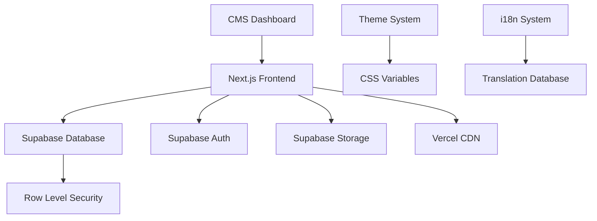
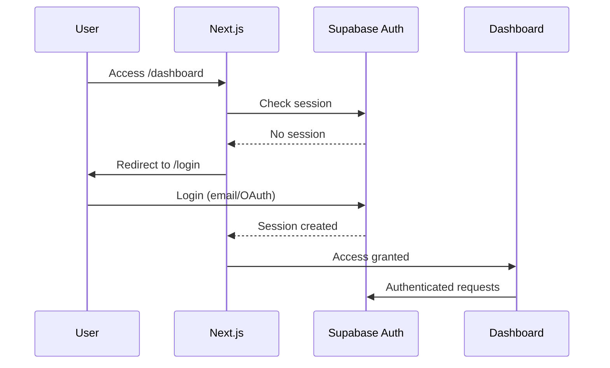

# Design Document

## Overview

The multilingual portfolio will be built as a modern, performant web application using Next.js 14 with the App Router, TypeScript, and Tailwind CSS for the frontend, backed by Supabase for authentication, database, and storage. The architecture emphasizes performance through static generation, accessibility through semantic design, and maintainability through clean separation of concerns.

The design follows a magazine-inspired aesthetic with asymmetrical layouts, layered components, and smooth animations while maintaining excellent Core Web Vitals scores and WCAG 2.1 AA compliance.

## Architecture

### High-Level Architecture



### Technology Stack

**Frontend:**

- Next.js 14 (App Router) with TypeScript
- Tailwind CSS with custom design tokens
- Framer Motion for animations
- React Hook Form for form management
- Next.js Image optimization

**Backend & Database:**

- Supabase PostgreSQL database
- Supabase Auth (email + OAuth)
- Supabase Storage for media files
- Row Level Security (RLS) policies

**Deployment & Infrastructure:**

- Vercel for hosting and CDN
- GitHub Actions for CI/CD
- Environment-based configuration

### Data Flow

1. **Public Pages:** SSG/ISR → Supabase (read-only) → CDN delivery
2. **Dashboard:** SSR/Client-side → Supabase (authenticated) → Real-time updates
3. **Media:** Upload → Supabase Storage → CDN → Optimized delivery
4. **Themes:** JSON storage → CSS variables → Real-time application

## Components and Interfaces

### Core Components

#### Layout System

```typescript
// Layout hierarchy
Layout.Root
├── Layout.Header (navigation, theme/language switchers)
├── Layout.Main (page content)
└── Layout.Footer

// Specialized layouts
Layout.Asymmetric (magazine-style grid)
Layout.Masonry (projects display)
Layout.Editorial (blog posts)
```

#### Content Components

```typescript
// Project components
ProjectCard (interactive hover states)
ProjectGrid (masonry layout)
ProjectDetail (full project view)

// Blog components
PostCard (preview with excerpt)
PostGrid (filterable list)
PostDetail (full article view)

// Media components
ImageOptimized (next/image wrapper)
MediaUploader (dashboard component)
ImageGallery (project galleries)
```

#### Interactive Components

```typescript
// Theme system
ThemeProvider (context + CSS variables)
ThemeSwitcher (live preview + persistence)
ThemeEditor (dashboard component)

// Language system
LanguageProvider (i18n context)
LanguageSwitcher (locale toggle)
TranslationEditor (dashboard component)

// CMS components
MarkdownEditor (with live preview)
FormBuilder (reusable form components)
MediaManager (file organization)
```

### API Design

#### Public API Routes

```typescript
// Static data fetching
/api/projects (published projects)
/api/posts (published posts)
/api/themes (public themes)
/api/translations (UI translations)

// Dynamic routes
/api/revalidate (webhook for ISR)
```

#### Database Schema

```sql
-- Core tables
profiles (user management)
projects (portfolio items)
posts (blog content)
themes (visual themes)
translations (i18n strings)
media (file metadata)

-- Relationships
projects.created_by → profiles.id
posts.created_by → profiles.id
themes.created_by → profiles.id
```

### Authentication Flow



## Data Models

### Core Entities

#### Profile

```typescript
interface Profile {
  id: string // UUID from auth.users
  display_name: string
  role: 'admin' | 'editor' | 'author'
  bio?: string
  avatar_url?: string
  created_at: string
  updated_at: string
}
```

#### Project

```typescript
interface Project {
  id: string
  title: string
  slug: string
  description?: string
  cover_path?: string
  github_url?: string
  live_demo_url?: string
  tags: string[]
  metadata: {
    tech_stack?: string[]
    duration?: string
    role?: string
  }
  published: boolean
  published_at?: string
  created_by: string
  created_at: string
  updated_at: string
}
```

#### Post

```typescript
interface Post {
  id: string
  title: string
  slug: string
  excerpt?: string
  body: string // Markdown content
  cover_path?: string
  tags: string[]
  language: 'en' | 'ne'
  published: boolean
  published_at?: string
  created_by: string
  created_at: string
  updated_at: string
}
```

#### Theme

```typescript
interface Theme {
  id: string
  slug: string
  name: string
  data: {
    colors: {
      primary: string
      secondary: string
      accent: string
      background: string
      surface: string
      text: string
    }
    fonts: {
      heading: string
      body: string
      mono: string
    }
    spacing: {
      scale: number
      rhythm: number
    }
  }
  is_public: boolean
  created_by: string
  created_at: string
}
```

#### Translation

```typescript
interface Translation {
  id: string
  key: string // e.g., "hero.title"
  language: 'en' | 'ne'
  value: string
}
```

### Database Relationships

- `profiles` ← `projects.created_by`
- `profiles` ← `posts.created_by`
- `profiles` ← `themes.created_by`
- `media` → `projects.cover_path` (optional)
- `media` → `posts.cover_path` (optional)

## Error Handling

### Client-Side Error Boundaries

```typescript
// Global error boundary
<ErrorBoundary fallback={<ErrorFallback />}>
  <App />
</ErrorBoundary>

// Page-level error handling
// app/error.tsx (Next.js 14 convention)
export default function Error({ error, reset }) {
  return <ErrorPage error={error} onRetry={reset} />;
}
```

### API Error Handling

```typescript
// Standardized error responses
interface APIError {
  message: string
  code: string
  details?: any
}

// Error handling middleware
const handleSupabaseError = (error: PostgrestError) => {
  // Map Supabase errors to user-friendly messages
  // Log errors for monitoring
  // Return appropriate HTTP status codes
}
```

### Graceful Degradation

- **Theme loading failure:** Fall back to default theme
- **Translation loading failure:** Fall back to English
- **Image loading failure:** Show placeholder with retry option
- **API failure:** Show cached content with offline indicator

## Testing Strategy

### Unit Testing

```typescript
// Component testing with React Testing Library
describe('ProjectCard', () => {
  it('displays project information correctly', () => {
    // Test component rendering and interactions
  })
})

// Utility function testing
describe('theme utilities', () => {
  it('applies theme variables correctly', () => {
    // Test theme application logic
  })
})
```

### Integration Testing

```typescript
// API route testing
describe('/api/projects', () => {
  it('returns published projects only', async () => {
    // Test API endpoints with mock data
  })
})

// Database testing
describe('Project model', () => {
  it('enforces RLS policies correctly', async () => {
    // Test database constraints and policies
  })
})
```

### End-to-End Testing

```typescript
// Critical user journeys
describe('Content Management Flow', () => {
  it('allows creating and publishing a project', () => {
    // Test complete CMS workflow
  })
})

describe('Public Site Navigation', () => {
  it('allows browsing projects and posts', () => {
    // Test public site functionality
  })
})
```

### Performance Testing

- Lighthouse CI integration
- Core Web Vitals monitoring
- Bundle size analysis
- Image optimization verification

### Accessibility Testing

- Automated testing with axe-core
- Manual keyboard navigation testing
- Screen reader compatibility testing
- Color contrast validation

## Performance Optimization

### Static Generation Strategy

```typescript
// ISR for dynamic content
export const revalidate = 3600 // 1 hour

// Static generation for stable content
export async function generateStaticParams() {
  const projects = await getPublishedProjects()
  return projects.map(project => ({ slug: project.slug }))
}
```

### Image Optimization

```typescript
// Responsive images with Next.js
<Image
  src={project.cover_path}
  alt={project.title}
  width={800}
  height={600}
  sizes="(max-width: 768px) 100vw, (max-width: 1200px) 50vw, 33vw"
  priority={isAboveFold}
/>
```

### Code Splitting

```typescript
// Dynamic imports for heavy components
const MarkdownEditor = dynamic(() => import('./MarkdownEditor'), {
  loading: () => <EditorSkeleton />,
  ssr: false
});
```

### Caching Strategy

- **Static assets:** Long-term caching with versioning
- **API responses:** Short-term caching with revalidation
- **Images:** CDN caching with transformation
- **Fonts:** Preload critical fonts, cache others

## Security Considerations

### Row Level Security Policies

```sql
-- Public read access for published content
CREATE POLICY "public_read_published" ON projects
  FOR SELECT USING (published = true);

-- Authors can manage their own content
CREATE POLICY "authors_manage_own" ON projects
  FOR ALL USING (auth.uid() = created_by);

-- Admins have full access
CREATE POLICY "admin_full_access" ON projects
  FOR ALL USING (
    EXISTS (
      SELECT 1 FROM profiles
      WHERE id = auth.uid() AND role = 'admin'
    )
  );
```

### Environment Security

```typescript
// Client-side (safe to expose)
NEXT_PUBLIC_SUPABASE_URL
NEXT_PUBLIC_SUPABASE_ANON_KEY

// Server-side only (never expose)
SUPABASE_SERVICE_ROLE_KEY
REVALIDATION_SECRET
```

### Content Security

- Input sanitization for user content
- XSS prevention in markdown rendering
- File upload validation and scanning
- Rate limiting for API endpoints

## Deployment Architecture

### Vercel Configuration

```json
{
  "buildCommand": "npm run build",
  "outputDirectory": ".next",
  "installCommand": "npm ci",
  "framework": "nextjs",
  "functions": {
    "app/api/**/*.ts": {
      "maxDuration": 30
    }
  }
}
```

### Environment Management

- **Development:** Local Supabase + local environment
- **Staging:** Supabase staging + Vercel preview
- **Production:** Supabase production + Vercel production

### CI/CD Pipeline

```yaml
# GitHub Actions workflow
name: CI/CD
on: [push, pull_request]
jobs:
  test:
    runs-on: ubuntu-latest
    steps:
      - uses: actions/checkout@v3
      - name: Run tests
        run: npm test
      - name: Run Lighthouse CI
        run: npm run lighthouse:ci
  deploy:
    needs: test
    runs-on: ubuntu-latest
    if: github.ref == 'refs/heads/main'
    steps:
      - name: Deploy to Vercel
        run: vercel --prod
```

This design provides a solid foundation for building a high-performance, accessible, and maintainable multilingual portfolio website that meets all the specified requirements while following modern web development best practices.
